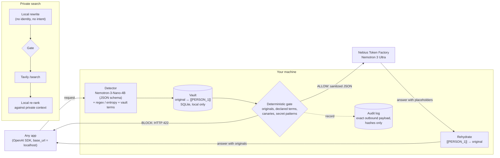

# Airlock

**A local privacy airlock between your apps and cloud AI.**

Point any OpenAI-compatible app at `http://127.0.0.1:8787/v1`. Before a request leaves your machine, a small model running locally finds what is private, the vault swaps it for placeholders, and a deterministic gate checks the exact outbound bytes. The large cloud model does the reasoning on the sanitized text. The answer is restored locally, and every request leaves an audit record of exactly what the cloud saw.

> The small local model does not solve the task. It only decides what is private. The big cloud model does the reasoning.

## Why

People and companies avoid cloud AI mainly because of leakage: names, customer data, health details, credentials pasted into a prompt. Local-only models avoid the leak, but they are much weaker than frontier models. Airlock splits the job:

- **On device:** NVIDIA Nemotron-3-Nano-4B proposes sensitive spans. Regex and entropy detectors add a deterministic floor for secrets and Korean identifiers.
- **In the cloud:** Nemotron 3 Ultra on Nebius Token Factory answers the sanitized request.
- **Between them:** a gate written in plain code, not a prompt. A model never gets to say "this is fine."

It works with tools you already use (scripts, notebooks, editors, agents) by changing one `base_url`.

## Architecture



Request flow for `POST /v1/chat/completions`:

1. **Detect.** Every text slot (message content, text parts, tool-call arguments) goes through the regex and entropy detectors, exact matching against the vault (your declared terms and this conversation's earlier originals), and the local LLM detector with a JSON-schema-constrained output. The prompt lives in [`airlock/prompts/detector.md`](airlock/prompts/detector.md).
2. **Resolve and substitute.** Overlapping spans are resolved with a longest-span-wins rule. Each original gets a typed placeholder (`[[PERSON_1]]`, `[[SECRET_1]]`, ...) or, for quasi-identifiers, a generalization ("in their 30s"). Within a conversation, the same original always maps to the same placeholder.
3. **Gate.** The final outbound JSON is walked string by string, keys and numbers included. If any vault original, declared term, canary, or high-confidence secret or ID pattern is still present, or if the request contains content Airlock cannot inspect (images), the request is blocked with HTTP 422. "Present" covers variants, not only exact text:
   - letter case, full-width characters, and zero-width or other invisible format characters
   - inserted spaces or punctuation (`새론 다움물류` matches `새론다움물류`)
   - numbers written with separators, spaced-out digits, or Korean, Hanja or English numerals (`공일공 이삼사오 …`)
   - values hidden inside JSON strings (tool-call arguments), percent-encoding, or base64/base64url, up to two layers deep

   The vault matcher uses the same normalized views, so a variant is usually masked rather than blocked. If the local model is down or returns unusable output, the request is also blocked. Airlock fails closed.
4. **Upstream.** The exact bytes that passed the gate go to Token Factory. If the primary model returns 5xx or reports itself unavailable, Airlock retries once on the fallback model. That attempt is also audited.
5. **Rehydrate.** Placeholders in the answer, including tool-call arguments and streamed deltas, are mapped back to the originals on your machine.
6. **Audit.** One record per request stores the outbound payloads verbatim, detections as SHA-256 hashes, the gate decision, and timings.

## Quickstart

Requirements: macOS or Linux, Python 3.12, [uv](https://docs.astral.sh/uv/), [llama.cpp](https://github.com/ggml-org/llama.cpp) (`llama-server`).

```bash
git clone https://github.com/tristan-kkim/airlock && cd airlock
uv sync

# 1. Local detector model (Nemotron-3-Nano-4B GGUF via llama-server on 127.0.0.1:8081)
scripts/local_model/serve.sh

# 2. Keys
cp .env.example .env   # set NEBIUS_API_KEY and TAVILY_API_KEY

# 3. Check everything (never prints secrets), then run
uv run airlock doctor
uv run airlock serve   # http://127.0.0.1:8787
```

See [`scripts/local_model/serve.sh`](scripts/local_model/serve.sh) for downloading the model and serving it.

Open <http://127.0.0.1:8787/> for the demo UI. It has three panes: **What you typed**, **What the cloud saw**, and **Answer (rehydrated)**, plus the gate decision and detections.

Use it from any OpenAI client:

```python
from openai import OpenAI

client = OpenAI(base_url="http://127.0.0.1:8787/v1", api_key="unused-locally")
reply = client.chat.completions.create(
    model="any",  # Airlock always uses AIRLOCK_UPSTREAM_MODEL
    messages=[{"role": "user", "content": "I'm Jane Park, 010-2345-6789. Draft a note to my landlord."}],
)
print(reply.choices[0].message.content)  # contains your real name and number again
```

Run the tests (fully offline, all services mocked):

```bash
uv run pytest -q
uv run ruff check
uv run pytest -m live   # opt-in: real local model / Token Factory / Tavily using .env
```

## How Airlock uses NVIDIA Nemotron and Nebius Token Factory

Airlock is built around a division of labour between two NVIDIA open models.

| Role | Model | Where it runs | Why this model |
|---|---|---|---|
| Privacy detector, search rewriter, result re-ranker | **NVIDIA Nemotron-3-Nano-4B** (`nvidia/NVIDIA-Nemotron-3-Nano-4B-GGUF`, Q4_K_M) | On your machine via llama.cpp | Small enough to run on a laptop, and it follows a JSON schema reliably. It sees raw private text, so it must never leave the device. Reasoning is disabled per request (`chat_template_kwargs.enable_thinking=false`) to keep latency low. |
| Reasoning over the sanitized request | **NVIDIA Nemotron 3 Ultra** (`nvidia/Nemotron-3-Ultra-550b-a55b`) | **Nebius Token Factory** (OpenAI-compatible API) | A frontier-class open model for the real task. It only ever receives placeholders and generalizations, and in our tests it keeps `[[PERSON_1]]`-style placeholders intact, including in Korean output. |
| Fallback | **NVIDIA Nemotron 3 Super** (`nvidia/nemotron-3-super-120b-a12b`) | Nebius Token Factory | Used once, automatically, when Ultra returns 5xx or is unavailable. `reasoning_effort` is dropped for this model because it rejects that field. Its `reasoning_content` is hidden from clients unless they opt in. |

Token Factory is on the execution path of every allowed chat request: `POST https://api.tokenfactory.nebius.com/v1/chat/completions` with `Authorization: Bearer $NEBIUS_API_KEY`. Airlock forwards `tools`, `tool_choice`, `reasoning_effort` and `stream` unchanged. It does not rely on upstream `response_format: json_schema`.

**Data retention.** By default, Token Factory may store prompts and outputs unless Zero Data Retention (ZDR) is enabled for your account or project. We recommend enabling ZDR. Airlock's guarantee does not depend on it: whatever the provider keeps is the sanitized payload shown in the audit log, never your originals.

Web search uses [Tavily](https://tavily.com) (`POST /search`, basic depth). Nemotron-3-Nano rewrites the query locally before it is sent, and re-ranks the results locally afterwards.

## Configuration

All settings are environment variables. Airlock also reads `.env`; see [`.env.example`](.env.example).

| Variable | Default | Purpose |
|---|---|---|
| `AIRLOCK_LOCAL_BASE_URL` | `http://127.0.0.1:8081/v1` | Local OpenAI-compatible server (llama.cpp) |
| `AIRLOCK_LOCAL_MODEL` | `nemotron-3-nano-4b` | Model name sent to the local server |
| `AIRLOCK_LOCAL_DISABLE_THINKING` | `true` | Send `chat_template_kwargs.enable_thinking=false` |
| `NEBIUS_API_KEY` | none | Token Factory key |
| `AIRLOCK_UPSTREAM_BASE_URL` | `https://api.tokenfactory.nebius.com/v1` | Upstream API |
| `AIRLOCK_UPSTREAM_MODEL` | `nvidia/Nemotron-3-Ultra-550b-a55b` | Primary cloud model |
| `AIRLOCK_UPSTREAM_FALLBACK_MODEL` | `nvidia/nemotron-3-super-120b-a12b` | Retried once on 5xx or model unavailable; empty disables it |
| `TAVILY_API_KEY` | none | Tavily key for `/v1/search` |
| `AIRLOCK_VAULT_PATH` | `./.airlock/vault.sqlite3` | Vault (holds originals; `:memory:` for none on disk) |
| `AIRLOCK_AUDIT_DB` | `./.airlock/audit.sqlite3` | Audit log |
| `AIRLOCK_AUDIT_HASH_KEY` | none | HMAC key for audit hashes; if unset, one is generated at the key file |
| `AIRLOCK_AUDIT_HASH_KEY_FILE` | `./.airlock/audit_hash.key` | Where the generated key is stored (mode 600) |
| `AIRLOCK_PROTECTION_LEVEL` | `balanced` | `strict`, `balanced` or `minimal` (see below) |
| `AIRLOCK_CANARIES` | none | Comma-separated tripwire strings that must never leave |
| `AIRLOCK_HOST` / `AIRLOCK_PORT` | `127.0.0.1` / `8787` | Bind address |
| `AIRLOCK_ALLOWED_HOSTS` | `127.0.0.1,localhost,::1` | Accepted `Host` headers (DNS-rebinding protection); `*` disables |

Protection levels:

| Level | Direct identifiers and secrets | Quasi-identifiers, health, precise location |
|---|---|---|
| `strict` | masked | always masked with placeholders; the detector is told to flag aggressively |
| `balanced` | masked | generalized as the detector suggests ("34" → "in their 30s") |
| `minimal` | masked | `QUASI_IDENTIFIER` spans are left as-is; health and location are still generalized |

## API

### `POST /v1/chat/completions`

OpenAI-compatible request and response, streaming included. Airlock-specific headers:

- Response `x-airlock-request-id`: key for `GET /audit/{id}`.
- Request/response `x-airlock-conversation-id`: scopes placeholder numbering. If omitted, it is derived from the first user message.
- Request `x-airlock-include-reasoning: 1`: forward the model's `reasoning_content` (rehydrated). Off by default.

Forwarded fields: `messages`, `tools`, `tool_choice`, `parallel_tool_calls`, `reasoning_effort`, `stream`, `stream_options`, `temperature`, `top_p`, `max_tokens`, `max_completion_tokens`, `n`, `stop`, `seed`, `presence_penalty`, `frequency_penalty`, `response_format`, `logprobs`, `top_logprobs`. Everything else (`user`, `metadata`, ...) is dropped. `model` is always replaced by `AIRLOCK_UPSTREAM_MODEL`.

Blocked requests return HTTP 422:

```json
{"error": {"type": "airlock_blocked", "reasons": ["declared_term:PERSON:6e0aeb4d2ed5"], "request_id": "req_..."}}
```

Reason codes: `vault_original`, `declared_term`, `canary`, `secret_pattern:<rule>`, `uninspectable_content:<part type>`, `local_detector_unavailable:<error>`, and for search also `local_rewriter_unavailable:<error>`, `rewrite_empty`, `rewrite_contains_placeholder`. Reasons carry the first 12 hex characters of the value's keyed hash (see the audit section), never the text.

Other errors: `400 invalid_request_error`, `415` (non-JSON POST), `502 airlock_upstream_error`, `503 airlock_not_configured`.

### `POST /v1/search`

```json
{"query": "Can my employer fire me without severance?", "context": "I'm Minji Lee at ...", "max_results": 5}
```

Returns `{"request_id", "outbound_query", "results": [{"title", "url", "content", "score", "local_rank"}], "answer"}`. The context never leaves the machine. Masked values found in the query or context may not appear in the rewritten query; generalized topics (a condition, an age range) may.

### `GET /audit/{request_id}`

```json
{
  "request_id": "req_...", "created_at": "2026-09-13T12:00:00+00:00", "kind": "chat",
  "detections": [{"text_sha256": "...", "type": "PERSON", "action": "mask", "source": "llm"}],
  "outbound": [{"destination": "upstream", "payload": {"model": "...", "messages": ["..."]}}],
  "gate": {"decision": "allow", "reasons": []},
  "timings_ms": {"detect": 212.4, "gate": 0.8, "upstream": 1530.2, "rehydrate": 0.1, "total": 1745.0},
  "meta": {"stream": false, "model_used": "nvidia/Nemotron-3-Ultra-550b-a55b", "fallback": false}
}
```

`text_sha256` is **HMAC-SHA256** of the original under the local audit key (`AIRLOCK_AUDIT_HASH_KEY`, or the generated `.airlock/audit_hash.key`). The field name is kept for compatibility. To check whether a value you know was detected, compute `hmac.new(key, value.encode(), hashlib.sha256).hexdigest()`. The key is never served over HTTP. `action` is `mask`, `generalize`, or `keep` (detected but intentionally left, under `minimal`). `outbound` holds one entry per payload that was sent, so a fallback produces two. `GET /audit?limit=50` lists recent records.

### `POST /vault/terms`

```json
{"terms": ["Jane Park", "Hanbit Labs"], "type": "PERSON", "kind": "sensitive"}
```

`kind: "sensitive"` terms are always masked and enforced by the gate. `kind: "canary"` terms are never masked: if one reaches an outbound payload, the request is blocked. Returns `{"added", "total", "kind"}`.

### `DELETE /vault/terms`

Body `{"terms": ["Hanbit Labs"], "kind": "sensitive"}` (`kind` optional; omitted removes both kinds). Returns `{"removed", "total"}`.

### `POST /vault/reset`

Body `{}`. Clears every declared term, canary and conversation mapping, plus the in-memory detector cache. Audit records are kept. Returns `{"reset": true, "terms_removed", "mappings_removed"}`. Evaluation harnesses call it between runs instead of restarting the server.

All `POST` endpoints require `Content-Type: application/json`, including `/vault/reset`.

### `GET /healthz`

Status, version, protection level, model names, and whether keys are configured. It makes no network calls.

## Threat model and limitations

**What Airlock is designed to stop:** accidental disclosure of identifying or secret strings from your machine to a cloud LLM provider or a web search provider, through an app you control that talks to the OpenAI API.

**What it guarantees, and how:** a string that Airlock knows is sensitive cannot leave through the proxy in any JSON field. That holds regardless of letter case, Unicode width, invisible characters, inserted spaces or punctuation, digit separators or spelled-out numerals, or base64, percent or JSON-string encoding up to two layers deep. "Knows" means it was detected in this request, detected earlier in the conversation, declared by you, configured as a canary, or matched by a high-confidence secret or ID pattern. This check is plain code on the final bytes. A misbehaving local model can cause over-masking or a block. It cannot cause a known string to be sent.

**What it does not protect against.** Please read this before relying on it.

- **Detector misses.** If the local model and the regexes both fail to recognise something (an unusual name, an internal project described in plain words), and you did not declare it, it is sent. The gate only enforces what is known. Declare your own name, employer, and key project names with `/vault/terms`.
- **Paraphrase and inference.** Airlock removes strings, not meaning. "My wife, the only female neurosurgeon at the hospital in our small town" contains no name and may still identify someone. Generalization of quasi-identifiers reduces this; it does not eliminate it.
- **Combining requests.** The provider sees many sanitized requests from the same account and may link them.
- **Non-text content.** Images, audio, and files are not inspected, so requests containing them are blocked rather than sent.
- **Tool schemas and names are not rewritten.** Rewriting them would break function calling. The gate still scans them and blocks if they contain known sensitive strings.
- **Search results and answers.** Inbound content is not filtered, and a cloud answer may still mention public facts about you.
- **Your machine.** The vault stores originals in plain text under `./.airlock/`. Anyone with access to your account or disk can read it. Airlock does not protect against malware, a compromised local model server, or other local users. Keep `.airlock/` out of backups and file-sync tools you do not trust, or use `AIRLOCK_VAULT_PATH=:memory:`.
- **Other obfuscations.** The variants listed for the gate are covered. Translation, transliteration (`Kim Minsu` for `김민수`), deliberate misspellings, other encodings (hex, ROT13, compression), splitting a value across messages or fields, and encoding more than two layers deep are not.
- **Audit hashes.** Detections and gate reasons use HMAC-SHA256 under a local key, so the audit file alone does not let anyone brute-force short values such as phone numbers. Anyone who has both the audit file and the key (`.airlock/audit_hash.key`, mode 600) can still test guesses. Protect or rotate the key like the vault. Rotating it makes older records unmatchable.
- **Local API exposure.** The server listens on loopback, checks the `Host` header, and requires JSON content types to resist browser-based cross-origin requests. It has no authentication. Do not expose it on a network.
- **Streaming.** Placeholders split across chunks are held back until complete. Tool-call deltas are buffered and delivered in one piece at the end of the stream.

## Project layout

```
airlock/
  config.py         env configuration
  detect/llm.py     local model client + LLM span detector (fail-closed errors)
  detect/patterns.py Korean-aware PII regexes, secret patterns, entropy check
  detect/spans.py   span model, term matching, overlap resolution
  pipeline.py       detection -> policy -> vault substitution for chat payloads
  vault.py          original <-> placeholder mappings, declared terms (SQLite)
  gate.py           deterministic allow/block on the exact outbound payload
  textnorm.py       normalized views (compact, digits, decoded) with raw offset maps
  hashing.py        HMAC key loading for audit hashes
  upstream.py       Token Factory client with one-shot fallback
  rehydrate.py      placeholder restoration, including streams and tool calls
  search.py         private search: local rewrite, gate, Tavily, local re-rank
  audit.py          audit records (hashes only)
  server.py         FastAPI app
  cli.py            `airlock serve`, `airlock doctor`
  prompts/          detector, search rewrite and re-rank prompts
  static/index.html demo UI
scripts/local_model/  llama.cpp serving for the local model
eval/                 synthetic evaluation set and harness
tests/                offline test suite
```

All examples and evaluation data are synthetic.

## License

Apache License 2.0. Copyright 2026 Tristan Kim. See [LICENSE](LICENSE).
