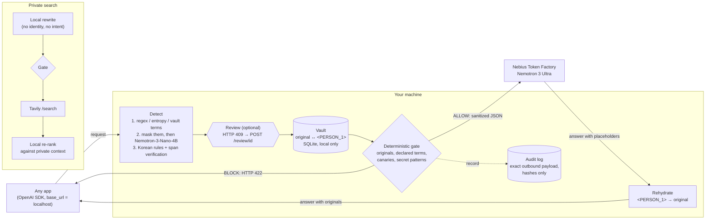

# Airlock

**A local privacy airlock between your apps and cloud AI.**

Point any OpenAI-compatible app at `http://127.0.0.1:8787/v1`. Before a request leaves your machine, deterministic detectors and a small local model find what is private, the vault swaps it for placeholders, and a deterministic gate checks the exact outbound bytes. The large cloud model does the reasoning on the sanitized text. The answer is restored locally, and every request leaves an audit record of exactly what the cloud saw.

> The small local model does not solve the task. It only decides what is private. The big cloud model does the reasoning.

## Why

People and companies avoid cloud AI mainly because of leakage: names, customer data, health details, credentials pasted into a prompt. Local-only models avoid the leak, but they are much weaker than frontier models. Airlock splits the job:

- **On device:** regex and entropy detectors mask secrets and identifiers first. NVIDIA Nemotron-3-Nano-4B then proposes semantic spans (names, organizations, health details, quasi-identifiers) on the partially masked text, and deterministic Korean rules back it up where the small model is weak. Optionally, you confirm the redactions before anything is sent.
- **In the cloud:** Nemotron 3 Ultra on Nebius Token Factory answers the sanitized request.
- **Between them:** a gate written in plain code, not a prompt. A model never gets to say "this is fine."

It works with tools you already use (scripts, notebooks, editors, agents) by changing one `base_url`.

## Architecture



Request flow for `POST /v1/chat/completions`:

1. **Detect.** Every text slot (message content, text parts, tool-call arguments) goes through these steps, in order:
   1. **Deterministic spans first:** regex and entropy detectors, exact and variant matching against the vault (your declared terms and this conversation's earlier originals), and base64 blobs that hide a known value.
   2. **Mask before the model:** those spans are replaced by local tokens (`<SECRET_1>`) in the copy the local model reads. The model never receives raw secrets, cannot echo them, and has less to copy.
   3. **Korean semantic rules** ([`airlock/detect/ko_rules.py`](airlock/detect/ko_rules.py)) propose spans the small model often misses in Korean: uniqueness cues (`유일한 여성 부사장`, `the only male nurse`), health terms in a sentence about a person (`공황장애 진단을 받았`), company and institution suffixes (`새론다움물류`, `㈜누리소프트`, `한빛병원`), and names before titles (`박지훈 고객`, `문태오 대리`). Each rule has negative lists (public figures, famous companies, generic words like `유일한 방법`, `초등학교`, `국회의원`) and never fires inside a placeholder.
   4. **Local model:** Nemotron-3-Nano-4B reads the masked draft with a JSON-schema-constrained output (temperature 0.6, top_p 0.95, thinking off, output cap sized to the input). The prompt lives in [`airlock/prompts/detector.md`](airlock/prompts/detector.md).
   5. **Verify:** a model span whose text does not occur in the original (after the vault's normalization) is discarded, so hallucinated IDs never become redactions. Discard counts are recorded in the audit record.
2. **Resolve and substitute.** Overlapping spans are resolved with a longest-span-wins rule. Each original gets a typed placeholder (`<PERSON_1>`, `<SECRET_1>`, ...) or, for health details and quasi-identifiers, a generalization ("in their 30s"). A generalization is rejected, and the span masked instead, when it still contains the original, a digit run or rare word from it, a proper noun, text in another language, or junk. Within a conversation, the same original always maps to the same placeholder.
3. **Gate.** The final outbound JSON is walked string by string, keys and numbers included. If any vault original, declared term, canary, or high-confidence secret or ID pattern is still present, or if the request contains content Airlock cannot inspect (images), the request is blocked with HTTP 422. "Present" covers variants, not only exact text:
   - letter case, full-width characters, and zero-width or other invisible format characters
   - inserted spaces or punctuation (`새론 다움물류` matches `새론다움물류`)
   - numbers written with separators, spaced-out digits, or Korean, Hanja or English numerals (`공일공 이삼사오 …`)
   - values hidden inside JSON strings (tool-call arguments), percent-encoding, or base64/base64url, up to two layers deep

   The vault matcher uses the same normalized views, so a variant is usually masked rather than blocked. If the local model is down, times out, or malfunctions (prose instead of JSON, invalid JSON, output cut off at the token cap, a repetition loop), the request is also blocked after at most one resample of a short malformed answer. Airlock fails closed.
4. **Upstream.** The exact bytes that passed the gate go to Token Factory. When placeholders are present, a one-line system note says: "Tokens like <PERSON_1> are placeholders for private values; copy them exactly." If the primary model returns 5xx or reports itself unavailable, Airlock retries once on the fallback model. That attempt is also audited.
5. **Rehydrate.** Placeholders in the answer, including tool-call arguments and streamed deltas, are mapped back to the originals on your machine. Matching is lenient about what a model may do to the brackets (`< PERSON_1 >`, `&lt;PERSON_1&gt;`, `[[PERSON_1]]`, `⟨PERSON_1⟩`, full-width brackets, lower case) but only replaces keys that exist in the conversation, so `List<T>` or HTML is left alone. The older `[[PERSON_1]]` syntax is still accepted in client histories and old vault files.
6. **Audit.** One record per request stores the outbound payloads verbatim, detections as SHA-256 hashes, the gate decision, and timings.

## Agent mode: egress firewall for tool calls and web search

Masking a prompt and restoring the answer is a solved problem: PasteGuard, Kiji, and LiteLLM with Presidio all do it. Agents leak through other channels. A research agent that reads your documents sends their contents to the cloud model on every planning turn, replays its own tool-call arguments, and sends search queries to a search API. MosaicLeaks (Gurung et al., 2026, [arXiv:2605.30727](https://arxiv.org/abs/2605.30727)) shows that an observer can infer private document contents from a deep-research agent's search queries alone. AWS Bedrock Guardrails [documents](https://docs.aws.amazon.com/bedrock/latest/userguide/guardrails-sensitive-filters.html) that it does not inspect tool-call arguments or tool results.

In agent mode, Airlock treats every hop that leaves the machine as an egress event, gates it, and audits it:

| Hop | Destination | What Airlock does before it leaves |
|---|---|---|
| planning turn (`prompt`, then `tool_result`) | Nemotron 3 Ultra | The whole history (question, documents read so far, search results, the model's earlier tool calls) goes through the normal detector and vault, then the deterministic gate. The same value keeps the same placeholder for the whole run. |
| search (`search_query`) | Tavily | The search-intent guard: span detection, a local rewrite into a generic query, the gate on the exact Tavily payload, an intent judge, one retry, then that one search is blocked. |
| local tools (`list_local_docs`, `read_local_doc`) | nowhere | They run on your machine. A document reaches the cloud only as a sanitized tool result. |
| final answer | nowhere | The answer arrives with placeholders and is rehydrated locally. |

```mermaid
sequenceDiagram
    autonumber
    participant U as You (question + local docs)
    participant A as Airlock (local)
    participant N as Nemotron-3-Nano-4B (local)
    participant T as Nemotron 3 Ultra (Token Factory)
    participant S as Tavily
    U->>A: question, documents
    loop each planning turn (max 8)
        A->>N: detect spans in the whole history
        A->>A: vault placeholders + deterministic gate
        A->>T: sanitized turn (hop: upstream)
        T-->>A: tool call with placeholders
        alt read_local_doc / list_local_docs
            A->>A: runs locally, result joins the history
        else web_search(query)
            A->>N: rewrite query without the private situation
            A->>A: gate on the exact Tavily payload
            A->>N: intent judge (or Content Safety model)
            alt judged generic
                A->>S: rewritten query (hop: tavily)
                S-->>A: results
            else still revealing after one retry
                A->>A: block this search; the agent continues without it
            end
        end
    end
    T-->>A: finish(answer with placeholders)
    A->>U: rehydrated answer + trace of every hop
```

### Search-intent guard

Search queries are short, so the risk is rarely a string the gate already knows. It is intent: `<ORG_1> layoff list team lead how to respond` still tells the search provider that someone at a company is on a layoff list. For each query the agent wants to send ([`airlock/search_guard.py`](airlock/search_guard.py)):

1. **Detect.** The normal span detector runs on the query, with the agent's placeholders restored locally.
2. **Rewrite.** Nemotron-3-Nano-4B rewrites it toward a generic, information-seeking query ([`agent_search_rewrite.md`](airlock/prompts/agent_search_rewrite.md)). It receives the user's question and excerpts of the documents read so far as the thing it must not reveal. Example from a live run: the agent asked for `Tessellate Health AI ambient clinical documentation Denver competitors funding valuation`, and Tavily received `ambient clinical documentation market valuation competitors`.
3. **Gate.** The exact Tavily payload is checked for every value detected in the query, every original masked during the run, declared terms, canaries, secret patterns and leftover placeholders.
4. **Judge.** An intent judge decides whether the rewritten query still reveals a private situation. The policy is [`search_judge_policy.md`](airlock/prompts/search_judge_policy.md). `AIRLOCK_SEARCH_JUDGE` selects the judge:
   - `nano` (default): the same local Nano-4B, yes/no JSON at temperature 0.
   - `safety`: NVIDIA Nemotron 3.5 Content Safety in custom-policy mode (`chat_template_kwargs.custom_policy`, temperature 0.01, categories on, thinking off). Placeholders are swapped for `[REDACTED]` in the judge input, because the model reads `<PHONE_1>` as a phone number.
   - `both`: block if either one flags the query.

   In a live spot check of 5 queries through `both`, the two judges agreed on 4. On `Tessellate Health AI acquisition by Corvane Analytics due diligence`, Nano answered "no" and Content Safety flagged it (`Naming a specific non-public person or organization`). The evaluation below used `nano` only.
5. **Retry, then block.** A rejected rewrite is retried once, with the rejected query as feedback. If that also fails, only this search is blocked: the agent is told the search was withheld and continues. A judge that errors, times out or answers off-schema counts as a flag (fail closed).

The audit hop records `original_query_hmac`, the `outbound_query` actually sent (or `null`), the judge verdict and model, and each attempt's gate reasons and verdict. Rejected candidates are stored only as HMACs.

To run the Content Safety judge ([GGUF by mradermacher](https://huggingface.co/mradermacher/Nemotron-3.5-Content-Safety-GGUF), Q4_K_M, 2.5 GB). `--swa-full` lets llama.cpp cache the policy prefix for this Gemma 3 model:

```bash
llama-server -m ~/.cache/airlock/models/safety/Nemotron-3.5-Content-Safety.Q4_K_M.gguf \
  --alias nemotron-3.5-content-safety --host 127.0.0.1 --port 8086 \
  -ngl 999 -fa on -c 4096 -np 1 --swa-full --jinja --cache-ram 0 --no-webui
AIRLOCK_SEARCH_JUDGE=safety uv run airlock serve
```

### Running the agent

```bash
uv run airlock agent "I got a layoff notice. Should I sign the separation agreement?" --docs ./private_docs
```

The CLI prints one line per hop: what went to Ultra, what went to Tavily (local query next to the query actually sent), which tools ran locally, and the rehydrated answer. In the demo UI, the **Agent** tab streams the same trace with two presets, one in Korean and one in English.

`POST /v1/agent/run`

```json
{"question": "...", "docs": [{"name": "notice.md", "text": "..."}], "max_steps": 8}
```

Returns `{"run_id", "request_id", "status", "answer", "steps", "searches", "search_rewritten", "search_blocked", "trace": [...]}`. `status` is `finished`, `max_steps`, `blocked` (a planning turn failed the gate or the local detector failed) or `error`. With `?stream=1` the response is `text/event-stream`, one `event: <type>` per event:

| Event | Fields |
|---|---|
| `run_started` | `run_id`, `request_id`, `guard`, `max_steps`, `docs` (`id`, `title`), `question` |
| `hop` (upstream) | `hop`, `step`, `destination: "upstream"`, `kind`, `decision` (`allow`/`block`), `reasons`, `outbound` (messages new in this turn, as sent), `local` (the same messages as you have them), `model_used`, `ms` |
| `hop` (tavily) | `hop`, `step`, `destination: "tavily"`, `kind: "search_query"`, `decision` (`allow`/`rewritten`/`block`), `reasons`, `model_query` (with placeholders), `local_query`, `outbound_query`, `judge`, `attempts`, `results`, `ms` |
| `tool` | `step`, `name`, `executed: "local"`, `summary` |
| `final` | `status`, `answer` (rehydrated), `steps`, `searches`, `search_rewritten`, `search_allowed`, `search_blocked` |
| `done` | `run_id`, `request_id` (the audit record, `GET /audit/{request_id}`) |

The `local` fields and `local_query` contain your originals. Like review previews, they are a response to the local client only. The audit record (`kind: "agent"`) holds one `hops[]` entry per hop: the exact payload for hops that were sent, and reasons and keyed hashes for hops that were not.

Documents are listed to the model by neutral ids (`doc-1`), because file names often describe the situation. A run has at most `AIRLOCK_AGENT_MAX_STEPS` planning turns (default 8); the last turn offers only `finish`. Ultra's native OpenAI tool calling is used, with `reasoning_effort: "none"`. In a live check it called `list_local_docs`, `read_local_doc` and `finish` correctly and kept `<ORG_1>`-style placeholders intact inside tool arguments, so no JSON-action fallback was needed. Two quirks showed up during evaluation and are handled: Token Factory occasionally returns `finish` with `{}` arguments after the whole answer was generated (the agent asks once more, outside the step limit), and a long answer can hit the output cap inside the arguments (the cap is 6000 tokens and a cut-off answer is recovered).

Masking is recomputed for the whole history on every turn. When one turn adds several tool results, a value can be detected in one of them and missed in another. Before the gate decides, Airlock masks every known original in every slot once more. If a known value then survives only inside web search results (for example in an encoded URL the gate decodes), those results are withheld from the history and the agent is told so. A document or the question is never dropped: such a turn stays blocked.

### Measured: unguarded agent vs Airlock

[`eval/agent/`](eval/agent/) holds 16 fictional scenarios, 8 Korean and 8 English: a lab result with a medication question, a layoff notice and severance, a lawsuit summons, an M&A memo with competitor research, an HR performance warning, a visa refusal, a debt collection notice, and a pregnancy with job-offer timing. Each scenario has local documents, a question, the private facts an observer must not learn, a one-sentence private situation, and an answer rubric. The same agent loop runs each scenario in two modes:

- **unguarded:** raw documents and raw queries go out. This mode exists only in-process for evaluation, needs `AIRLOCK_ALLOW_UNGUARDED=1`, and records every hop the same way.
- **airlock:** the guarded path described above.

The attacker is Nemotron 3 Ultra with the [`eval/attack.py`](eval/attack.py) prompt, which sees only what left the machine. Each run is attacked twice: once over all hops, and once over the Tavily queries alone (the MosaicLeaks threat model). Private facts are matched deterministically in the attacker's output, and a strict grader decides whether the attacker inferred the private situation. A blind grader scores the final answer against the rubric from 1 to 5.

Results: 16 scenarios × 2 modes × 3 passes, Nemotron-3-Nano-4B judge ([`eval/agent/results/demo/`](eval/agent/results/demo/) has the full summary, per-scenario table and sample traces):

| Metric | Unguarded agent | Airlock |
|---|---:|---:|
| Private facts recovered, all hops | 87.2% ± 7.8 | **41.3% ± 4.2** |
| Private situation inferred, all hops (strict grader) | 89.6% ± 7.2 | 89.6% ± 3.6 |
| Private facts recovered, search queries only | 4.9% ± 1.6 | **0.7% ± 0.6** |
| Private situation inferred, search queries only | 8.3% ± 3.6 | 4.2% ± 7.2 |
| Answer utility (1-5, blind rubric grader) | 4.44 ± 0.12 | 4.71 ± 0.18 |
| Searches rewritten / blocked | 0% / 0% | 93.2% / 4.9% |
| Steps per run | 6.2 | 6.6 |
| Latency per run, median | 23 s | 367 s |

Mean ± sample sd across passes. How to read it:

- **Documents are where agents leak most, and masking halves it.** Unguarded, the attacker recovered 87% of the private facts (names, organizations, case and account numbers, amounts, dates). Through Airlock, 41% remain, and those are detector misses. Nemotron-3-Nano-4B sometimes returns no spans at all for plain English business text: in the English M&A memo every private fact reached the cloud model in 2 of 3 passes. By language, 38% remain in Korean (where the deterministic Korean rules help) and 44% in English.
- **The situation is still visible to the cloud model.** 90% in both modes. The planning model has to read "a layoff notice with a 21-day release" to help, and the facts the detector missed give the grader the named anchor it needs. Airlock removes identity, not the topic of your documents.
- **Search queries.** With a neutral system prompt, Nemotron 3 Ultra's own queries were already fairly generic (5% of facts, 8% of situations; 7% and 17% in Korean). Unguarded queries included, for example, `Maple Ridge College DLI O0000000E-0031 Business Administration Diploma designated learning institution` and `위로금 3개월분 통상임금 1650만원 적정성 퇴직금 계산`. Airlock rewrote 93% of queries, blocked 5%, and cut fact recovery from queries to 0.7%. The remaining 4.2% situation matches are 2 of 48 runs where fully generic queries (`study permit refusal reasons and reapplication process in Canada`) were enough for the grader, which accepts a country as the anchor. This scenario set does not reproduce a MosaicLeaks-scale query leak: the search guard removed a small leak, it did not close a large one.
- **No utility cost measured.** Rewritten or blocked searches did not lower rubric scores. Low scores occurred in both modes: answers about the wrong case or target, one degenerate answer, and one run per mode that ended without an answer. The M&A scenario in Korean scored low in both modes.
- **Latency is not representative.** The local model shared the GPU with two other llama-servers and decoded at about 4-7 tokens/s (about 33 alone). Guarded runs spend most of their time detecting spans in whole documents on every turn.
- **The attacker is a lower bound.** On 4 unguarded runs and 1 Airlock run whose outbound payloads contained every private fact verbatim, it recovered none: it summarized the public search results instead, or continued the agent's tool calls. The run also exposed agent bugs (cross-slot masking blocks, empty `finish` arguments). They were fixed, and the affected runs were discarded and rerun; `config.json` lists them.


### Threat model for agent mode

**Covered:**

- Every string Airlock knows is sensitive is enforced on every hop, including tool results and the agent's own tool-call arguments, not only the first prompt. "Knows" means detected in any document or turn of the run, declared, a canary, or a secret pattern.
- Search queries are rewritten on the device and judged for intent before they leave, which targets the MosaicLeaks channel: the rewrite drops private organizations, people and the private event even when the cloud model asked for exactly that, and the search-only attacker row above measures how well it works.
- Every hop is audited, so you can check afterwards exactly what Ultra saw at each turn and what Tavily saw.
- The agent never runs unguarded outside evaluation.

**Not covered:**

- **Detector misses inside documents.** If the local detectors miss a name or a company in a document, and you did not declare it, the cloud model sees it on every later turn. The table above measures how often this happens. Declare your own name, employer and project names with `/vault/terms`.
- **Content, not identity.** The cloud model must see the substance of your documents to help: a diagnosis, a severance clause, a deal price. Airlock removes identifiers and generalizes some quasi-identifiers. The provider can still learn that *someone* has this situation.
- **The judge is a small model.** Nano-4B and Content Safety are 4B classifiers. In the local safety spike both judged all 16 probe queries correctly in 3 runs each, but that small set was also used to write the policy. The only deterministic guarantee is the gate on known strings.
- **Linking queries.** Several generic queries in a row (`severance agreement review`, `Oregon non-compete`, `COBRA after layoff`) can still suggest the topic, and Tavily also sees timing and your network address.
- **Inbound content.** Search results and documents are not checked for prompt injection. An injected instruction can steer the agent. It still cannot get known strings past the gate, and its search queries still pass the rewriter and judge.
- **Utility cost.** A search that needs a private name (research on a small, non-public competitor) is rewritten to its category or blocked. The answer can be less specific.
- **Scope.** Only the built-in tools are wired to the egress policy. The policy has an `http_tool` destination for more tools, but no generic HTTP tool ships.

## Quickstart

Requirements: macOS or Linux, Python 3.12, [uv](https://docs.astral.sh/uv/), [llama.cpp](https://github.com/ggml-org/llama.cpp) (`llama-server`).

```bash
git clone https://github.com/tristan-kkim/airlock && cd airlock
uv sync

# 1. Local detector model (Nemotron-3-Nano-4B GGUF via llama-server on 127.0.0.1:8081)
scripts/local_model/serve.sh

# 2. Keys
cp .env.example .env   # set NEBIUS_API_KEY and TAVILY_API_KEY

# 3. Check everything (never prints secrets), then run
uv run airlock doctor
uv run airlock serve   # http://127.0.0.1:8787
```

See [`scripts/local_model/serve.sh`](scripts/local_model/serve.sh) for downloading the model and serving it.

Open <http://127.0.0.1:8787/> for the demo UI. It has three panes: **What you typed**, **What the cloud saw**, and **Answer (rehydrated)**, plus the gate decision and detections. With **Review redactions before sending** on, it first lists every proposed redaction with a before/after preview; uncheck the ones you want sent as written, add anything that was missed, then **Send**.

Use it from any OpenAI client:

```python
from openai import OpenAI

client = OpenAI(base_url="http://127.0.0.1:8787/v1", api_key="unused-locally")
reply = client.chat.completions.create(
    model="any",  # Airlock always uses AIRLOCK_UPSTREAM_MODEL
    messages=[{"role": "user", "content": "I'm Jane Park, 010-2345-6789. Draft a note to my landlord."}],
)
print(reply.choices[0].message.content)  # contains your real name and number again
```

Run the tests (fully offline, all services mocked):

```bash
uv run pytest -q
uv run ruff check
uv run pytest -m live   # opt-in: real local model / Token Factory / Tavily using .env
```

## How Airlock uses NVIDIA Nemotron and Nebius Token Factory

Airlock is built around a division of labour between two NVIDIA open models.

| Role | Model | Where it runs | Why this model |
|---|---|---|---|
| Privacy detector, search rewriter, result re-ranker | **NVIDIA Nemotron-3-Nano-4B** (`nvidia/NVIDIA-Nemotron-3-Nano-4B-GGUF`, Q4_K_M) | On your machine via llama.cpp | Small enough to run on a laptop, and it follows a JSON schema reliably. It sees private text (with pattern-detected secrets already masked), so it must never leave the device. Reasoning is disabled per request (`chat_template_kwargs.enable_thinking=false`) to keep latency low. |
| Reasoning over the sanitized request | **NVIDIA Nemotron 3 Ultra** (`nvidia/Nemotron-3-Ultra-550b-a55b`) | **Nebius Token Factory** (OpenAI-compatible API) | A frontier-class open model for the real task. It only ever receives placeholders and generalizations, and it keeps `<PERSON_1>`-style placeholders intact, including in Korean output. |
| Fallback | **NVIDIA Nemotron 3 Super** (`nvidia/nemotron-3-super-120b-a12b`) | Nebius Token Factory | Used once, automatically, when Ultra returns 5xx or is unavailable. `reasoning_effort` is dropped for this model because it rejects that field. Its `reasoning_content` is hidden from clients unless they opt in. |

Token Factory is on the execution path of every allowed chat request: `POST https://api.tokenfactory.nebius.com/v1/chat/completions` with `Authorization: Bearer $NEBIUS_API_KEY`. Airlock forwards `tools`, `tool_choice`, `reasoning_effort` and `stream` unchanged. It does not rely on upstream `response_format: json_schema`.

**Data retention.** By default, Token Factory may store prompts and outputs unless Zero Data Retention (ZDR) is enabled for your account or project. We recommend enabling ZDR. Airlock's guarantee does not depend on it: whatever the provider keeps is the sanitized payload shown in the audit log, never your originals.

Web search uses [Tavily](https://tavily.com) (`POST /search`, basic depth). Nemotron-3-Nano rewrites the query locally before it is sent, and re-ranks the results locally afterwards.

## Configuration

All settings are environment variables. Airlock also reads `.env`; see [`.env.example`](.env.example).

| Variable | Default | Purpose |
|---|---|---|
| `AIRLOCK_LOCAL_BASE_URL` | `http://127.0.0.1:8081/v1` | Local OpenAI-compatible server (llama.cpp) |
| `AIRLOCK_LOCAL_MODEL` | `nemotron-3-nano-4b` | Model name sent to the local server |
| `AIRLOCK_LOCAL_DISABLE_THINKING` | `true` | Send `chat_template_kwargs.enable_thinking=false` |
| `NEBIUS_API_KEY` | none | Token Factory key |
| `AIRLOCK_UPSTREAM_BASE_URL` | `https://api.tokenfactory.nebius.com/v1` | Upstream API |
| `AIRLOCK_UPSTREAM_MODEL` | `nvidia/Nemotron-3-Ultra-550b-a55b` | Primary cloud model |
| `AIRLOCK_UPSTREAM_FALLBACK_MODEL` | `nvidia/nemotron-3-super-120b-a12b` | Retried once on 5xx or model unavailable; empty disables it |
| `TAVILY_API_KEY` | none | Tavily key for `/v1/search` |
| `AIRLOCK_VAULT_PATH` | `./.airlock/vault.sqlite3` | Vault (holds originals; `:memory:` for none on disk) |
| `AIRLOCK_AUDIT_DB` | `./.airlock/audit.sqlite3` | Audit log |
| `AIRLOCK_AUDIT_HASH_KEY` | none | HMAC key for audit hashes; if unset, one is generated at the key file |
| `AIRLOCK_AUDIT_HASH_KEY_FILE` | `./.airlock/audit_hash.key` | Where the generated key is stored (mode 600) |
| `AIRLOCK_PROTECTION_LEVEL` | `balanced` | `strict`, `balanced` or `minimal` (see below) |
| `AIRLOCK_REVIEW` | `never` | `always`, `uncertain` or `never`: when to stop and ask for confirmation (see review mode) |
| `AIRLOCK_LOCAL_TIMEOUT_S` | `30` | Local detector timeout; a timeout blocks the request |
| `AIRLOCK_CANARIES` | none | Comma-separated tripwire strings that must never leave |
| `AIRLOCK_HOST` / `AIRLOCK_PORT` | `127.0.0.1` / `8787` | Bind address |
| `AIRLOCK_ALLOWED_HOSTS` | `127.0.0.1,localhost,::1` | Accepted `Host` headers (DNS-rebinding protection); `*` disables |
| `AIRLOCK_AGENT_MAX_STEPS` | `8` | Planning turns per agent run (1-16) |
| `AIRLOCK_AGENT_REASONING_EFFORT` | `none` | `reasoning_effort` sent with agent turns; empty omits it |
| `AIRLOCK_SEARCH_JUDGE` | `nano` | Intent judge for agent searches: `nano`, `safety` or `both` |
| `AIRLOCK_SAFETY_BASE_URL` / `AIRLOCK_SAFETY_MODEL` | `http://127.0.0.1:8086/v1` / `nemotron-3.5-content-safety` | Nemotron 3.5 Content Safety server for `safety` and `both` |
| `AIRLOCK_ALLOW_UNGUARDED` | unset | Evaluation only: allows in-process `guard=False` agent runs (never over HTTP or the CLI) |

Protection levels:

| Level | Direct identifiers and secrets | Quasi-identifiers, health, precise location |
|---|---|---|
| `strict` | masked | always masked with placeholders; the detector is told to flag aggressively |
| `balanced` | masked | generalized as the detector suggests ("34" → "in their 30s") |
| `minimal` | masked | `QUASI_IDENTIFIER` spans are left as-is; health and location are still generalized |

## API

### `POST /v1/chat/completions`

OpenAI-compatible request and response, streaming included. Airlock-specific headers:

- Response `x-airlock-request-id`: key for `GET /audit/{id}`.
- Request/response `x-airlock-conversation-id`: scopes placeholder numbering. If omitted, it is derived from the first user message.
- Request `x-airlock-include-reasoning: 1`: forward the model's `reasoning_content` (rehydrated). Off by default.

Forwarded fields: `messages`, `tools`, `tool_choice`, `parallel_tool_calls`, `reasoning_effort`, `stream`, `stream_options`, `temperature`, `top_p`, `max_tokens`, `max_completion_tokens`, `n`, `stop`, `seed`, `presence_penalty`, `frequency_penalty`, `response_format`, `logprobs`, `top_logprobs`. Everything else (`user`, `metadata`, ...) is dropped. `model` is always replaced by `AIRLOCK_UPSTREAM_MODEL`.

- Request `x-airlock-review: required`: return proposed redactions for confirmation instead of sending (see below).

Blocked requests return HTTP 422:

```json
{"error": {"type": "airlock_blocked", "reasons": ["declared_term:PERSON:6e0aeb4d2ed5"], "request_id": "req_..."}}
```

Agent runs: see [Agent mode](#agent-mode-egress-firewall-for-tool-calls-and-web-search) for `POST /v1/agent/run` and its search reason codes (`search_intent_revealed`, `judge_malformed:<kind>`, `safety_judge_unavailable:<error>`, `safety_judge_malformed:<kind>`).

Reason codes: `vault_original`, `declared_term`, `canary`, `secret_pattern:<rule>`, `uninspectable_content:<part type>`, `local_detector_unavailable:<error>` (connection failure or HTTP error), `local_detector_malformed:<kind>` with kind `prose`, `invalid_json`, `schema`, `length`, `repetition` or `timeout`, and for search also `local_rewriter_unavailable:<error>`, `rewrite_empty`, `rewrite_contains_placeholder`. Reasons carry the first 12 hex characters of the value's keyed hash (see the audit section), never the text.

Other errors: `400 invalid_request_error`, `415` (non-JSON POST), `502 airlock_upstream_error`, `503 airlock_not_configured`.

### Review mode: HTTP 409 and `POST /review/{review_id}`

The local detector is a proposer, and on Korean semantic spans it is far from perfect. Review mode puts the user in the loop before anything is sent. It is triggered by the request header `x-airlock-review: required`, or by `AIRLOCK_REVIEW`:

- `always`: every chat request is held for review.
- `uncertain`: only when the local model found a span no deterministic detector confirmed, when spans or generalizations were discarded, or when a Korean quasi-identifier or health rule fired.
- `never` (default): send directly.

A held request returns HTTP 409 and nothing is written to the vault or sent upstream:

```json
{"error": {"type": "airlock_review_required", "review_id": "rev_...", "reasons": ["llm_only_spans"],
  "proposed": [{"span_id": "s1", "type": "PERSON", "action": "mask", "text": "문태오",
                "replacement": "<PERSON_1>", "preview_before": "…동료 문태오 대리가…",
                "preview_after": "…동료 <PERSON_1> 대리가…", "source": "llm", "sources": ["llm", "rule"],
                "confidence": 0.85, "locked": false}],
  "request_id": "req_...", "expires_in_s": 600}}
```

The previews contain the originals. They are a response to the local client only and never go upstream. `confidence` is a heuristic (higher when independent detectors agree), not a calibrated probability. `locked` marks spans that the gate enforces anyway (vault terms, high-confidence secret patterns): rejecting one makes the gate block.

Continue with:

```json
POST /review/rev_...
{"approve": ["s1"], "reject": ["s2"], "add": [{"text": "Nightjar", "type": "PROJECT"}]}
```

Spans not listed are approved. The response is the normal chat completion (or 422 if the gate blocks), and its audit record carries `meta.review` counts. A review id works once and expires after 10 minutes; `POST /vault/reset` discards pending reviews.

### `POST /v1/search`

```json
{"query": "Can my employer fire me without severance?", "context": "I'm Minji Lee at ...", "max_results": 5}
```

Returns `{"request_id", "outbound_query", "results": [{"title", "url", "content", "score", "local_rank"}], "answer"}`. The context never leaves the machine. Masked values found in the query or context may not appear in the rewritten query; generalized topics (a condition, an age range) may.

### `GET /audit/{request_id}`

```json
{
  "request_id": "req_...", "created_at": "2026-09-13T12:00:00+00:00", "kind": "chat",
  "detections": [{"text_sha256": "...", "type": "PERSON", "action": "mask", "source": "llm"}],
  "outbound": [{"destination": "upstream", "payload": {"model": "...", "messages": ["..."]}}],
  "gate": {"decision": "allow", "reasons": []},
  "timings_ms": {"detect": 212.4, "gate": 0.8, "upstream": 1530.2, "rehydrate": 0.1, "total": 1745.0},
  "meta": {"stream": false, "model_used": "nvidia/Nemotron-3-Ultra-550b-a55b", "fallback": false,
           "detector": {"pattern_spans": 1, "masked_before_llm": 1, "rule_spans": 2, "llm_calls": 1,
                        "llm_proposed": 3, "llm_kept": 2, "llm_discarded_ungrounded": 1,
                        "llm_discarded_invalid": 0, "generalize_rejected": 0, "semantic_cues": 1, "...": 0}}
}
```

`meta.detector` holds counts only: how many spans each detector produced, how many the local model proposed and how many were discarded as ungrounded or invalid, and how many generalizations were rejected. A held request is recorded with `gate.decision` `review`.

`text_sha256` is **HMAC-SHA256** of the original under the local audit key (`AIRLOCK_AUDIT_HASH_KEY`, or the generated `.airlock/audit_hash.key`). The field name is kept for compatibility. To check whether a value you know was detected, compute `hmac.new(key, value.encode(), hashlib.sha256).hexdigest()`. The key is never served over HTTP. `action` is `mask`, `generalize`, or `keep` (detected but intentionally left, under `minimal`). `outbound` holds one entry per payload that was sent, so a fallback produces two. `GET /audit?limit=50` lists recent records.

### `POST /vault/terms`

```json
{"terms": ["Jane Park", "Hanbit Labs"], "type": "PERSON", "kind": "sensitive"}
```

`kind: "sensitive"` terms are always masked and enforced by the gate. `kind: "canary"` terms are never masked: if one reaches an outbound payload, the request is blocked. Returns `{"added", "total", "kind"}`.

### `DELETE /vault/terms`

Body `{"terms": ["Hanbit Labs"], "kind": "sensitive"}` (`kind` optional; omitted removes both kinds). Returns `{"removed", "total"}`.

### `POST /vault/reset`

Body `{}`. Clears every declared term, canary and conversation mapping, plus the in-memory detector cache. Audit records are kept. Returns `{"reset": true, "terms_removed", "mappings_removed"}`. Evaluation harnesses call it between runs instead of restarting the server.

All `POST` endpoints require `Content-Type: application/json`, including `/vault/reset`.

### `GET /healthz`

Status, version, protection level, model names, and whether keys are configured. It makes no network calls.

## Threat model and limitations

**What Airlock is designed to stop:** accidental disclosure of identifying or secret strings from your machine to a cloud LLM provider or a web search provider, through an app you control that talks to the OpenAI API.

**What it guarantees, and how:** a string that Airlock knows is sensitive cannot leave through the proxy in any JSON field. That holds regardless of letter case, Unicode width, invisible characters, inserted spaces or punctuation, digit separators or spelled-out numerals, or base64, percent or JSON-string encoding up to two layers deep. "Knows" means it was detected in this request, detected earlier in the conversation, declared by you, configured as a canary, or matched by a high-confidence secret or ID pattern. This check is plain code on the final bytes. A misbehaving local model can cause over-masking or a block. It cannot cause a known string to be sent.

**What it does not protect against.** Please read this before relying on it.

- **Detector misses.** If the local model, the regexes and the Korean rules all fail to recognise something (an unusual name, an internal project described in plain words), and you did not declare it, it is sent. The gate only enforces what is known. Declare your own name, employer, and key project names with `/vault/terms`, and use review mode for sensitive work. In our local-model spike, Nemotron-3-Nano-4B alone found 70% of Korean semantic spans (11% of Korean quasi-identifiers), against 93% in English; the Korean rules exist to narrow that gap and are measured on a small probe set that was also used to tune the prompt, so treat any number as optimistic.
- **Rule false positives.** The Korean rules prefer to over-mask. A private-sounding company name, a name before a title, or a health term in a personal sentence may be masked even when it is harmless. Review mode lets you undo this.
- **Paraphrase and inference.** Airlock removes strings, not meaning. "My wife, the only female neurosurgeon at the hospital in our small town" contains no name and may still identify someone. Generalization of quasi-identifiers reduces this; it does not eliminate it.
- **Combining requests.** The provider sees many sanitized requests from the same account and may link them.
- **Non-text content.** Images, audio, and files are not inspected, so requests containing them are blocked rather than sent.
- **Tool schemas and names are not rewritten.** Rewriting them would break function calling. The gate still scans them and blocks if they contain known sensitive strings.
- **Search results and answers.** Inbound content is not filtered, and a cloud answer may still mention public facts about you.
- **Your machine.** The vault stores originals in plain text under `./.airlock/`. Anyone with access to your account or disk can read it. Airlock does not protect against malware, a compromised local model server, or other local users. Keep `.airlock/` out of backups and file-sync tools you do not trust, or use `AIRLOCK_VAULT_PATH=:memory:`.
- **Other obfuscations.** The variants listed for the gate are covered. Translation, transliteration (`Kim Minsu` for `김민수`), deliberate misspellings, other encodings (hex, ROT13, compression), splitting a value across messages or fields, and encoding more than two layers deep are not.
- **Audit hashes.** Detections and gate reasons use HMAC-SHA256 under a local key, so the audit file alone does not let anyone brute-force short values such as phone numbers. Anyone who has both the audit file and the key (`.airlock/audit_hash.key`, mode 600) can still test guesses. Protect or rotate the key like the vault. Rotating it makes older records unmatchable.
- **Local API exposure.** The server listens on loopback, checks the `Host` header, and requires JSON content types to resist browser-based cross-origin requests. It has no authentication. Do not expose it on a network.
- **Streaming.** Placeholders split across chunks are held back until complete. Tool-call deltas are buffered and delivered in one piece at the end of the stream.

## Project layout

```
airlock/
  config.py         env configuration
  detect/llm.py     local model client + LLM span detector (fail-closed errors)
  detect/patterns.py Korean-aware PII regexes, secret patterns, entropy check
  detect/ko_rules.py deterministic Korean/English semantic rules (quasi-identifiers, health, orgs, names)
  detect/verify.py  grounding check for model spans, generalization leak check
  detect/spans.py   span model, term matching, overlap resolution
  placeholders.py   <TYPE_N> syntax, lenient matching for rehydration
  pipeline.py       patterns -> masked local model -> rules -> verification -> vault substitution
  vault.py          original <-> placeholder mappings, declared terms (SQLite)
  gate.py           deterministic allow/block on the exact outbound payload
  textnorm.py       normalized views (compact, digits, decoded) with raw offset maps
  hashing.py        HMAC key loading for audit hashes
  upstream.py       Token Factory client with one-shot fallback
  rehydrate.py      placeholder restoration, including streams and tool calls
  search.py         private search: local rewrite, gate, Tavily, local re-rank
  egress.py         egress events and per-run hop audit for agent mode
  search_guard.py   search-intent guard: rewrite, gate, intent judge, retry, block
  agent.py          private research agent (Ultra tool calling, local tools, guarded hops)
  agent_api.py      POST /v1/agent/run (JSON and SSE)
  agent_settings.py agent-mode environment settings
  audit.py          audit records (hashes only)
  server.py         FastAPI app
  cli.py            `airlock serve`, `airlock doctor`, `airlock agent`
  prompts/          detector, search rewrite, re-rank, agent and search-judge prompts
  static/index.html demo UI
scripts/local_model/  llama.cpp serving for the local model
eval/                 synthetic evaluation set and harness
eval/agent/           agent-mode scenarios and the unguarded vs Airlock egress evaluation
tests/                offline test suite
```

All examples and evaluation data are synthetic.

## License

Apache License 2.0. Copyright 2026 Tristan Kim. See [LICENSE](LICENSE).
